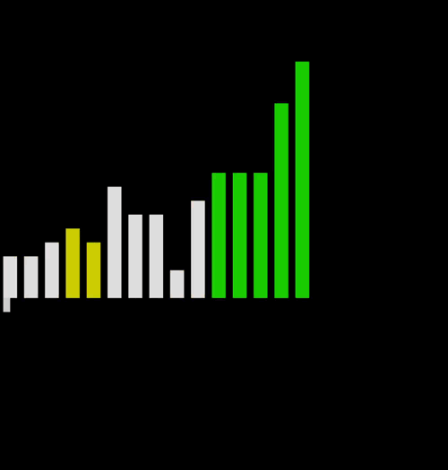
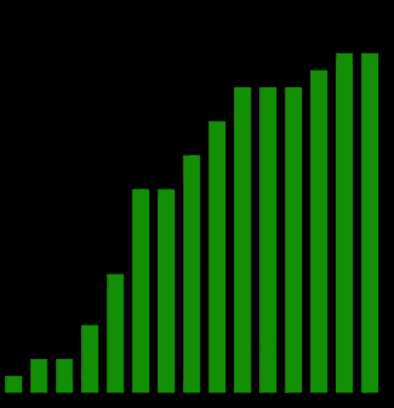
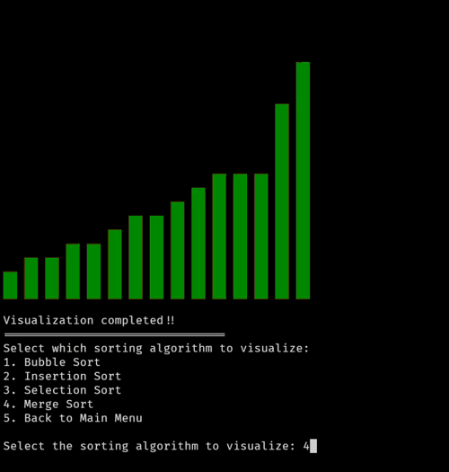
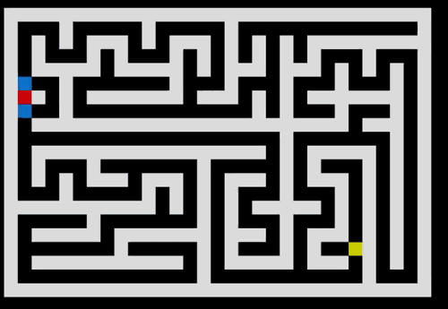
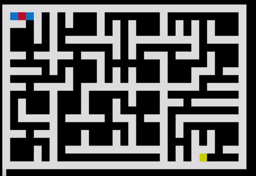
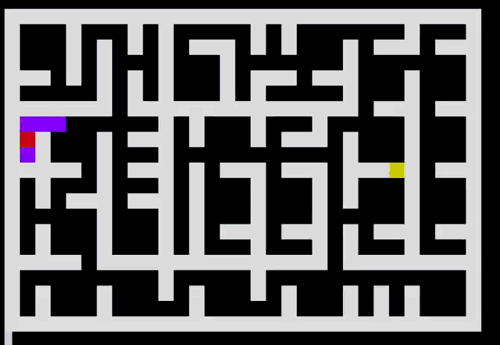
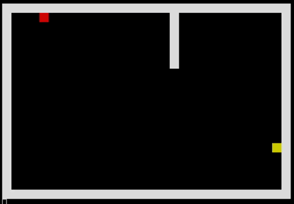
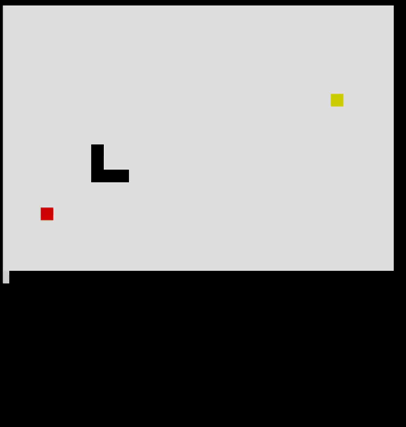

# Algorithm Visualizer

A Java-based terminal application for visualizing Sorting, Maze Generation and Path Finding Algorithms.

The project was built to recall/strengthen my understanding of algorithms, data structures, and object-oriented software design by implementing each algorithm from scratch and visualizing every stage of its execution.

> **Note**
>
> This project intentionally uses terminal-based rendering with ANSI escape sequences instead of Swing or JavaFX. The goal was to focus on implementing the algorithms and designing a reusable architecture rather than building a graphical user interface.

---

# Demo

<p align="center">
    
</p>

---

# Features

- Step-by-step visualization of classic algorithms
- Terminal-based animation using ANSI escape sequences
- Sorting algorithm visualizations
- Pathfinding algorithm visualizations
- Maze generation algorithm visualizations
- Modular object-oriented architecture
- Easy to extend with additional algorithms

---

# Implemented Algorithms

## Sorting Algorithms

| Algorithm | Visualization |
|-----------|---------------|
| Bubble Sort |  |
| Selection Sort |  |
| Insertion Sort |  |
| Merge Sort |  |

---

## Pathfinding Algorithms

| Algorithm | Visualization |
|-----------|---------------|
| Breadth First Search (BFS) |  |
| Depth First Search (DFS) |  |
| Dijkstra's Algorithm |  |
| Greedy Best First Search |  |
| A* Search |  |

---

## Maze Generation Algorithms

| Algorithm | Visualization |
|-----------|---------------|
| Recursive Division |  |
| Randomized DFS (Recursive Backtracker) |  |

---

# Project Goals

I first built a small algorithm visualizer many years ago but never published it, and the original code was eventually lost. Rebuilding the project became an opportunity to revisit the algorithms, reinforce the underlying concepts, and design a cleaner, more reusable architecture.

Rather than focusing on building a desktop GUI, I intentionally kept the project terminal-based so that the emphasis remained on algorithm implementation, software design, and visualization logic.

---

# Design Highlights

- Shared abstract base classes for each algorithm family
- Extensible design that allows new algorithms to be added with minimal changes
- Applied object-oriented design principles to reduce code duplication and improve reusability
- Implemented several design patterns, including:
  - Template Method
  - State
  - Facade

---

# Algorithms & Concepts

This project includes implementations and visualizations of:

## Data Structures

- Array
- Stack
- Queue
- Priority Queue

## Sorting

- Bubble Sort
- Selection Sort
- Insertion Sort
- Merge Sort

## Graph Algorithms

- Dijkstra's Algorithm
- A* Search
- Greedy Best First Search
- Breadth First Search
- Depth First Search

## Maze Generation

- Recursive Division
- Recursive Backtracker (Randomized DFS)

## Software Design

- Object-Oriented Programming
- Abstraction
- Inheritance
- Polymorphism
- Composition
- Separation of Concerns

---

# Running the Project

Clone the repository

```bash
git clone https://github.com/sanztastic/terminal-algorithm-visualizer.git
```

Navigate into the project

```bash
cd Algorithm-Visualizer
```

Compile

```bash
mvn compile
```

Run

```bash
mvn exec:java -Dexec.mainClass="com.example.App.java"
```

> **Note**
> 
> if using windows then choose windows terminal or powershell over classic command prompt.
> For IDE the visualization might flicker and not work on run console so opt for terminal.
 
---

# To Add

### Maze Generation

- Prim's Algorithm
- Kruskal's Algorithm

---

## Acknowledgements

The algorithm implementations are based on well-known computer science algorithms commonly taught in academic literature and publicly documented in textbooks and research resources. This project focuses on implementing and visualizing those algorithms in a reusable object-oriented framework.
